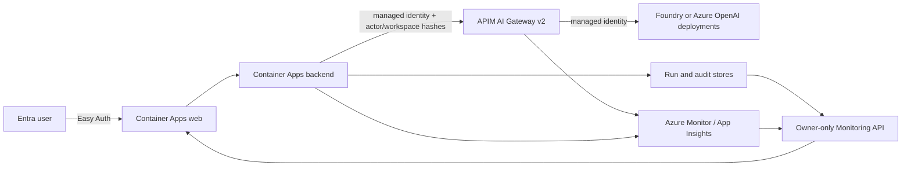

# DataForge Monitoring and Governance Implementation Plan

> **For agentic workers:** REQUIRED SUB-SKILL: Use `subagent-driven-development` (recommended) or `executing-plans` to implement this plan task-by-task. Steps use checkbox (`- [ ]`) syntax for tracking.

**Goal:** Deliver an Owner-only Monitoring surface that proves DataForge agent activity is attributable to Entra identities, metered by token and model, traceable to runs, and ready to consume Azure API Management and Foundry ROI Preview evidence without fabricating either capability.

**Architecture:** Keep DataForge as the workspace application and evidence owner. Route every supported text-model inference request from the Container Apps backend through an Azure API Management AI Gateway before it reaches the Microsoft Foundry or Azure OpenAI deployment. APIM emits privacy-safe token metrics and gateway correlation data to Azure Monitor; DataForge persists its own run, actor, model-policy, and outcome lineage, then serves a read-only aggregated Monitoring API to the Owner-only React page.

**Tech Stack:** FastAPI, React/Vite, Azure Container Apps, Microsoft Entra ID Easy Auth, Microsoft Foundry, Azure OpenAI-compatible Responses API, Azure API Management v2 AI Gateway, Azure Monitor/Application Insights, OpenTelemetry, Azure Storage, pytest, Node test runner.

## Global Constraints

- UI terminology is `Monitoring`; do not show `FinOps` in customer-facing navigation or headings.
- Only the persisted workspace Owner can view Monitoring data or change model routing policy. Backend authorization is mandatory; hiding UI is insufficient.
- Never manufacture token, cost, latency, cache, APIM, or ROI values. Unknown values render as unrecorded with provenance.
- Do not log prompt/completion text, API keys, bearer tokens, SAS values, connection strings, raw email addresses, or raw Entra object IDs into the Monitoring dataset.
- A run may claim `gateway_governed` only after a matching APIM correlation record is observed. No silent direct-endpoint fallback is permitted when gateway mode is enabled.
- APIM governs text-model inference first. Blob, SQL, Search, Speech, image generation, and ordinary browser-to-DataForge API traffic remain explicitly outside gateway coverage until separately onboarded.
- Foundry ROI is private preview as of this plan. DataForge must label its own ledger separately and cannot claim Foundry ROI connection without verified provider evidence.
- Do not modify Easy Auth login behavior or authorization allowlists as part of this work.
- Deploy to a Container Apps preview revision first; production receives traffic only after the acceptance matrix passes against the preview URL.

---

## Current-State Evidence

| Area | Verified current behavior | Consequence |
| --- | --- | --- |
| Inference path | `backend/foundry_client.py` creates an `AzureOpenAI` client from `OPENAI_ENDPOINT` or `AZURE_OPENAI_ENDPOINT` and hard-codes `DF_CHAT_DEPLOYMENT` at call sites. | Model calls bypass APIM today. |
| APIM | `az apim list -g rg-dataforge-dev` returned an empty array. The Container Apps backend has no APIM base URL, subscription, or gateway-mode environment setting. | No current APIM governance or APIM token metrics can be claimed. |
| Entra and audit | Runs, messages, audit events, and OpenTelemetry spans already carry a canonical actor or a one-way actor fingerprint. | The baseline for trustworthy actor attribution already exists. |
| Token and traces | Run storage persists input/output/total tokens when supplied by the model response. OpenTelemetry records `gen_ai.usage.*` and Application Insights is configured. | Local usage exists, but it is not gateway-metered or chart-oriented. |
| ROI | `backend/roi_service.py` and `backend/foundry_roi.py` provide a local outcome ledger and a guarded provider adapter. No official Foundry ROI Preview connection is verified. | The UI must distinguish local evidence from Foundry Preview status. |
| Model selection | The active text deployment is a server environment value. There is no policy-controlled, discoverable UI selection surface. | A safe allowlisted routing layer is required. |

## Target Experience

For a workspace Owner, the sidebar renders a subtle divider after `Artifacts` and a single `Monitoring` destination. Non-Owners do not receive the navigation item or backend data.

`Monitoring` has four internal tabs and a shared date range plus Agent/model/member filters:

1. **Overview**: five KPI cards (token usage, governed calls, priced cost, p95 elapsed time, failed calls), token trend split by input/output, top Agent/model/member contributors, and a bounded alert list.
2. **Attribution**: sortable per-member, per-Agent, per-model totals with evidence coverage. Actor labels are resolved only for the workspace Owner; API telemetry uses hashes.
3. **Reliability**: success/failure distribution, latency buckets, policy/gateway rejections, and a compact trend. An empty Azure Monitor query is an honest unavailable state, not a green health card.
4. **Run trace**: a paged run list with one selected run's model deployment, policy version, token components, actor, DataForge correlation ID, APIM correlation ID, audit events, and an outbound Foundry/Monitor link only when verified.

The existing ROI cards move into an Overview section named `Value evidence`. It shows three separate states: `DataForge estimate`, `Observed`, and `Verified`. A fourth card, `Foundry ROI Preview`, only shows `Not configured`, `Configured but unverified`, or `Connected` based on verified evidence; it never converts a local estimate into Foundry ROI.

## Azure Target Topology

### Required Azure Changes

1. Create or associate an APIM v2 AI Gateway with the current Foundry resource. Use **Standard v2** for the production path; Basic v2 is acceptable only for a development proof. Do not use Consumption because LLM token-limit policies are unavailable there.
2. Add the current Foundry project to the gateway. Existing projects are not automatically enrolled.
3. Enable APIM system-assigned managed identity and grant it `Cognitive Services User` on the model resource or Foundry resource that hosts the model deployments.
4. Configure APIM diagnostic output and LLM token metrics to the existing Application Insights/Log Analytics path. Retain only policy-approved metadata; prompt/completion logging is off by default.
5. Configure an Entra-protected backend-to-APIM path. The public browser must never call the gateway. APIM accepts only the DataForge backend identity, and the backend derives the actor/workspace correlation fields after Easy Auth validation.
6. Create APIM policies for the approved text-model API: managed-identity backend authentication, model deployment routing, token emission, token quota/rate limit, privacy-safe dimensions, and correlation propagation.
7. Keep current direct Azure OpenAI credentials during preview rollback only. Once gateway acceptance passes, production gateway mode must fail closed instead of silently falling back to the direct endpoint.

### Azure Permissions Needed From the Tenant Owner

| Action | Minimum role / access |
| --- | --- |
| Create APIM in `rg-dataforge-dev` | Contributor or Owner on the resource group/subscription |
| Associate APIM to Foundry AI Gateway | Foundry Account Owner or Foundry Owner on the Foundry resource, plus API Management Service Contributor or Owner on APIM |
| Configure APIM policies and diagnostics | API Management Service Contributor or Owner |
| Grant APIM identity model access | Owner or User Access Administrator on the model/Foundry resource, to assign `Cognitive Services User` |
| Read Application Insights/Log Analytics during validation | Monitoring Reader and Log Analytics Reader at the relevant scope |
| Foundry ROI Preview | Explicit private-preview enablement from Microsoft for the tenant/resource; no public API integration is assumed |

## Implementation Tasks

### Task 1: Establish a truthful Monitoring data contract

**Files:**
- Create: `backend/monitoring_service.py`
- Modify: `backend/control_plane.py`
- Modify: `backend/run_store.py`
- Modify: `backend/tracing.py`
- Create: `tests/test_monitoring_service.py`
- Modify: `tests/test_workspace_roles.py`

**Interfaces:**
- Produces `build_monitoring_snapshot(workspace_id: str, window: dict[str, str], filters: dict[str, str]) -> dict[str, Any]`.
- Produces `monitoring_run_detail(workspace_id: str, run_id: str) -> dict[str, Any]`.
- Extends each persisted run with `model_route`, `model_deployment`, `policy_version`, `gateway_mode`, and `gateway_correlation_id` only when supplied by verified runtime telemetry.

- [ ] Write failing tests for an Owner receiving a snapshot with known, partial, and unknown metrics; assert unknown metrics are `null` with explicit provenance.
- [ ] Write a failing test that a non-Owner receives `403` from every Monitoring endpoint.
- [ ] Implement server-side window parsing, bounded filters, aggregate-only snapshots, and run-detail projection. Reuse existing actor and token sanitizers.
- [ ] Persist model and gateway fields in the run record and emit matching OpenTelemetry attributes without raw identity or prompt text.
- [ ] Run `python -m pytest tests/test_monitoring_service.py tests/test_workspace_roles.py -q` and require all tests to pass.
- [ ] Commit with `feat: add monitoring evidence contract`.

### Task 2: Introduce safe model-route policy and discovery

**Files:**
- Create: `backend/model_policy.py`
- Modify: `backend/foundry_client.py`
- Modify: `backend/control_plane.py`
- Create: `tests/test_model_policy.py`
- Modify: `tests/test_foundry_client.py`

**Interfaces:**
- Produces `list_allowed_model_routes() -> list[ModelRoute]` from a server-owned allowlist and provider availability probe.
- Produces `resolve_model_route(workspace_id: str, capability: Literal["chat", "analysis", "research"]) -> ModelRoute`.
- Adds `GET /api/workspaces/{workspace_id}/monitoring/model-routes` and `PUT /api/workspaces/{workspace_id}/monitoring/model-policy`.

- [ ] Write failing tests proving an arbitrary deployment name is rejected and a non-Owner cannot read or mutate model policy.
- [ ] Write a failing test proving a route incompatible with the Responses API is excluded from the selectable list.
- [ ] Implement a server-only `DF_MODEL_ROUTE_ALLOWLIST` configuration with route id, deployment name, capability set, and display label. The provider catalog augments availability but cannot create a route by itself.
- [ ] Replace direct `DF_CHAT_DEPLOYMENT` reads at text-call boundaries with `resolve_model_route`; preserve the existing deployment as the default route.
- [ ] Persist policy version and effective deployment into each run and audit every policy change.
- [ ] Run `python -m pytest tests/test_model_policy.py tests/test_foundry_client.py -q` and require all tests to pass.
- [ ] Commit with `feat: add allowlisted model routing`.

### Task 3: Provision and configure APIM AI Gateway in a preview environment

**Files:**
- Create: `infra/apim/monitoring-gateway.bicep`
- Create: `infra/apim/policies/text-model.xml`
- Create: `infra/apim/README.md`
- Create: `scripts/verify_apim_gateway.py`
- Create: `tests/test_apim_gateway_contract.py`

**Interfaces:**
- Consumes `DF_APIM_GATEWAY_BASE_URL`, `DF_APIM_GATEWAY_ENABLED`, and `DF_APIM_EXPECTED_GATEWAY_ID` as Container Apps secrets/configuration.
- Produces a gateway response header `x-dataforge-gateway-correlation` and emits token metrics with `workspace_hash`, `actor_hash`, `run_hash`, `agent_name`, `model_route`, and `deployment` dimensions.

- [ ] Write a failing contract test that gateway mode rejects a response without a valid gateway correlation identifier.
- [ ] Write a failing policy fixture test that rejects missing backend identity and does not log raw prompt fields.
- [ ] Deploy Standard v2 APIM to preview or associate the approved existing v2 instance with the Foundry resource. Add the existing Foundry project to the gateway.
- [ ] Configure APIM managed identity with `Cognitive Services User` role on the target model/Foundry resource.
- [ ] Import the OpenAI-compatible text model API and apply: Entra caller validation, managed-identity backend authentication, token metric emission, request correlation, token rate limit, quota, and diagnostic logging.
- [ ] Run `python scripts/verify_apim_gateway.py --environment preview` and require an APIM correlation id, token metric record, and no prompt text in logs.
- [ ] Commit infrastructure definitions with `infra: add monitored APIM text gateway`.

### Task 4: Switch DataForge text inference to the gateway without fallback

**Files:**
- Modify: `backend/foundry_client.py`
- Modify: `backend/app.py`
- Modify: `backend/dependency_health.py`
- Modify: `backend/tracing.py`
- Create: `tests/test_gateway_client.py`
- Modify: `tests/test_dependency_health.py`

**Interfaces:**
- `gateway_client_for(route: ModelRoute, request_context: GatewayRequestContext) -> AzureOpenAI` chooses gateway mode only when configured.
- `GatewayRequestContext` carries hashed actor/workspace/run correlation and route metadata, never raw identity or customer content.

- [ ] Write failing tests for gateway URL selection, required correlation response header, and no direct-endpoint fallback while gateway mode is enabled.
- [ ] Implement APIM client configuration using the gateway base URL and backend-managed authentication. Preserve the direct endpoint only when `DF_APIM_GATEWAY_ENABLED=false`.
- [ ] Add health validation that tests the exact configured gateway route rather than a generic model endpoint.
- [ ] Add a trace event that labels a call `gateway_governed` only after the expected correlation value is observed.
- [ ] Run `python -m pytest tests/test_gateway_client.py tests/test_dependency_health.py -q` and require all tests to pass.
- [ ] Commit with `feat: route text inference through APIM gateway`.

### Task 5: Build the Owner-only Monitoring dashboard

**Files:**
- Create: `web/src/monitoringViewModel.js`
- Create: `web/src/monitoringViewModel.test.mjs`
- Modify: `web/src/api.js`
- Modify: `web/src/App.jsx`
- Modify: `web/src/components.jsx`
- Modify: `web/src/constants.js`
- Modify: `web/src/styles.css`
- Modify: `web/src/navigationContract.test.mjs`

**Interfaces:**
- Consumes `GET /api/workspaces/{id}/monitoring/overview`, `GET /monitoring/attribution`, `GET /monitoring/reliability`, `GET /monitoring/runs`, and `GET /monitoring/runs/{run_id}`.
- Renders `MonitoringPage` only when `access.role === "owner"`.
- Uses `MonitoringViewModel` to turn all missing evidence into a truthful empty state.

- [ ] Write failing view-model tests for full, partial, unknown, and unavailable data states.
- [ ] Write a failing navigation test that an Owner sees the subtle `Monitoring` section after Artifacts while an Editor sees neither navigation nor data.
- [ ] Implement the shared date range and filters plus Overview, Attribution, Reliability, and Run trace tabs. Use fixed chart containers so metrics do not shift layouts.
- [ ] Add the model-route policy panel to Settings for Owner only; it must show its effective-next-run behavior and policy audit history.
- [ ] Render `Value evidence` as a separate panel with DataForge/Foundry source badges. Do not use the word `FinOps` in customer-facing text.
- [ ] Run `node --test src/monitoringViewModel.test.mjs src/navigationContract.test.mjs` and `npm run build` from `web`.
- [ ] Commit with `feat: add owner monitoring workspace`.

### Task 6: Validate Entra attribution, ROI states, and Azure telemetry end-to-end

**Files:**
- Create: `scripts/monitoring_e2e.py`
- Create: `docs/monitoring-acceptance.md`
- Modify: `tests/test_actor_audit_usage.py`
- Modify: `tests/test_azure_monitor_status.py`
- Modify: `tests/test_roi_service.py`

**Interfaces:**
- `monitoring_e2e.py` returns a redacted JSON evidence file containing request ids, run ids, gateway correlation ids, metric timestamps, and assertion outcomes.

- [ ] Write failing tests for two Entra identities producing separate actor rows while neither raw object ID nor email appears in telemetry output.
- [ ] Write failing tests confirming DataForge estimate, observed outcome, independently verified outcome, and unconfigured Foundry ROI Preview remain distinct states.
- [ ] Run two actual signed-in workspace identities through preview: one analysis and one follow-up. Capture the corresponding APIM and Application Insights records using correlation ids.
- [ ] Verify each preview run's token components equal the persisted run usage within the documented provider rounding tolerance. Record the tolerance and metric timestamp in the evidence file.
- [ ] Verify a policy breach returns the expected 429/403 and creates an alert without retrying through a direct model endpoint.
- [ ] Verify a non-Owner gets `403` from Monitoring endpoints and does not see navigation.
- [ ] Commit evidence format and acceptance guide with `test: add monitoring production acceptance`.

### Task 7: Preview rollout, production cutover, and rollback drill

**Files:**
- Modify: `docs/monitoring-acceptance.md`
- Create: `scripts/deploy_monitoring_preview.ps1`
- Create: `scripts/deploy_monitoring_production.ps1`
- Create: `scripts/rollback_monitoring.ps1`

**Interfaces:**
- Preview and production deployment scripts require explicit image tags and refuse to deploy when `DF_APIM_GATEWAY_ENABLED=true` without `DF_APIM_EXPECTED_GATEWAY_ID`.

- [ ] Build backend and frontend images with immutable tags and deploy to the Container Apps preview revision.
- [ ] Run the full backend suite, frontend build, API E2E, and browser Owner/non-Owner smoke against preview.
- [ ] Save redacted evidence: APIM policy result, Application Insights metric query result, DataForge run detail, UI screenshots, and ROI source state.
- [ ] Shift production traffic only after every acceptance row passes. Keep the prior revision at zero traffic but available for rollback.
- [ ] Run the production smoke once, then execute the rollback script in dry-run mode and verify it selects the prior revision without shifting traffic.
- [ ] Commit deployment scripts with `chore: add monitored gateway rollout`.

## Acceptance Matrix

| Requirement | Proof required |
| --- | --- |
| Owner-only Monitoring | Owner browser screenshot + Owner API `200`; Editor browser screenshot + same API `403` |
| Entra attribution | Two distinct authenticated identities map to two actor rows; telemetry contains only hashes; audit retains the authorized display mapping |
| Token consumption | One completed call has SDK/run tokens and matched APIM token metric joined through correlation id |
| APIM enforcement | Gateway log includes policy id and correlation id; a quota test returns `429` or `403`; backend has no direct fallback event |
| Model selection | Owner selects an allowlisted deployed route; next run persists selected deployment/policy version; invalid/non-Owner updates fail |
| Reliability dashboard | A real failing or delayed preview request appears in the reliability query; empty/denied telemetry is visibly labeled unavailable |
| Traceability | Selected run shows DataForge run id, APIM correlation id, actor attribution, model route, token components, and audit events |
| ROI Preview | UI distinguishes local estimate/observed/verified from `Foundry ROI Preview: not configured`; it shows `Connected` only after verified provider evidence |
| Privacy | Evidence search confirms no prompt, completion, key, token, raw email, or raw object id in monitoring API/APIM dimensions |
| Rollout | Preview E2E, production smoke, and dry-run rollback evidence are captured before declaring production complete |

## Out of Scope for This Plan

- Routing browser-to-DataForge business APIs through APIM. That does not govern LLM token consumption and would add an unrelated ingress layer.
- Claiming that Blob, SQL, Search, Speech, or image generation is APIM-governed before separate API imports and coverage tests exist.
- Treating Foundry ROI private preview as an available production dependency.
- Showing arbitrary end-user model names or allowing free-form deployment identifiers.
- Turning on raw prompt/completion logging for dashboard convenience.

## Decision Gates

1. **Gateway model:** approve Microsoft Foundry AI Gateway on APIM Standard v2 for production, with Basic v2 allowed only for preview proof.
2. **Identity model:** approve backend-to-APIM Entra managed identity and APIM-to-model managed identity; do not use browser-held APIM subscription keys.
3. **Coverage:** approve text-model inference as the first governed scope; other AI services display as uncovered until separately onboarded.
4. **ROI:** approve DataForge local evidence as the shipped value view while Foundry ROI stays marked Preview/not configured until Microsoft enables the tenant.
5. **Model control:** approve Owner-only, allowlisted model routes effective on subsequent runs, rather than per-message unrestricted switching.

## Plan Self-Review

- Scope coverage: Monitoring UI, Entra attribution, token telemetry, trace correlation, APIM enforcement, model selection, and Foundry ROI Preview are each mapped to a task and acceptance proof.
- No fabricated cloud state: every Azure dependency has an explicit prerequisite and proof; current direct routing is documented as ungoverned.
- Security boundary: raw customer content and secrets are excluded from metrics, and gateway identity is service-to-service only.
- Deployment boundary: preview must pass evidence-based verification before production traffic changes.
