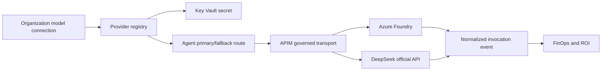

# DataForge External Model Providers, Cache Evidence, and Entra Governance Design

**Date:** 2026-07-27

**Status:** Approved for implementation planning

**Initial provider:** DeepSeek official API

**Scope:** Organization-level provider connections, per-Agent primary/fallback routing, APIM governance, two-layer cache evidence, provider-aware FinOps, and Entra group-to-role mapping

## 1. Purpose

Extend DataForge beyond Azure Foundry without changing the MAF analysis kernel or the existing workspace, data, conversation, run, and artifact responsibilities.

DeepSeek is the first external-provider implementation and the reference for later providers. The design must:

- let an organization Owner or Admin add a provider connection from the UI;
- keep provider credentials outside the browser, SQL payloads, logs, audit details, and Git;
- let each Agent select an Azure or DeepSeek primary and fallback model;
- preserve APIM governance as the default production transport;
- distinguish DataForge Redis reuse from DeepSeek provider-side KV cache;
- calculate provider-aware estimated cost without presenting estimates as cloud billing;
- expose Entra identity and group-based authorization without adding another top-level navigation item;
- preserve truthful partial, unavailable, unpriced, and unmanaged states.

This release does not:

- change the MAF graph or Agent business responsibilities;
- ingest Azure Cost Management, invoices, negotiated discounts, or DeepSeek account balance;
- accept arbitrary APIM XML, scripts, policy fragments, or Azure resource IDs;
- expose provider API keys after initial submission;
- modify Entra groups, Conditional Access, PIM, or directory roles;
- automatically switch production traffic or enable governance execution.

## 2. Accepted Direction

Use a unified Provider layer with a typed APIM governance bridge.

The business runtime invokes one internal model interface. Provider-specific authentication, request format, response parsing, usage, cache fields, retry rules, and error mapping stay behind adapters.

DeepSeek uses the official OpenAI-compatible base URL and Chat Completions contract. Future providers can use an OpenAI-compatible adapter or a provider-specific adapter without changing Agent code or Portal metrics.

## 3. Organization-Level Provider Connections

### 3.1 Connection record

Add an organization-scoped provider connection with:

- `provider_id`: server-generated opaque identifier;
- `tenant_ref`: derived from trusted Easy Auth claims, never accepted from the request body;
- `provider_type`: initially `deepseek`;
- `display_name`;
- `base_url`;
- `secret_ref`: Key Vault reference only;
- `connection_state`: `testing`, `connected`, `degraded`, `invalid`, or `disabled`;
- `governance_state`: `pending`, `governed`, `degraded`, or `unmanaged`;
- `available_models`: models returned by a successful server-side discovery or validation call;
- `last_tested_at`, `last_success_at`, and a safe error category;
- `revision` for optimistic concurrency;
- `created_by_ref`, `updated_by_ref`, and timestamps.

The public response never returns the secret value, provider response body, raw provider request ID, tenant ID, actor object ID, or internal Azure resource ID.

### 3.2 Secret handling

The UI sends an API key once over the authenticated HTTPS connection. The backend:

1. validates authorization and the endpoint;
2. writes a new Key Vault secret version through managed identity;
3. stores only the secret reference in the provider registry;
4. tests the connection from the backend;
5. returns a masked status such as `已安全保存 · 上次验证成功`.

Rotation creates a new Key Vault secret version. Disabling a connection prevents new routing but preserves historical request and cost evidence. Hard deletion is not required in the first release.

The API key must not appear in:

- frontend state after the save request completes;
- API responses;
- application, APIM, audit, or browser logs;
- exception text;
- SQL rows or exports;
- screenshots, test fixtures, Git history, or deployment commands.

### 3.3 Endpoint validation

Provider endpoints must:

- use HTTPS;
- match the server-owned provider host allowlist, initially `api.deepseek.com`;
- reject user info, query credentials, fragments, nonstandard redirect targets, link-local addresses, loopback addresses, private addresses, and cloud metadata endpoints;
- revalidate DNS and every redirect target before sending a credential;
- use fixed request timeouts and bounded response sizes.

Supporting a private enterprise proxy later requires an explicit server-owned allowlist revision, not an arbitrary URL submitted by the client.

### 3.4 Management interfaces

Add typed endpoints:

- `GET /api/model-providers`
- `POST /api/model-providers`
- `POST /api/model-providers/{provider_id}/test`
- `POST /api/model-providers/{provider_id}/rotate-secret`
- `PATCH /api/model-providers/{provider_id}`
- `POST /api/model-providers/{provider_id}/disable`

Creation and secret rotation accept a write-only `api_key`. Update requests include `base_revision`; stale writes return `409` without changing Key Vault, SQL, APIM, or route configuration.

Only organization Owner or Admin roles may manage provider connections. Every mutation requires durable audit persistence before it is reported as successful.

## 4. Provider Adapters and APIM Transport

### 4.1 Internal invocation contract

Introduce one provider-neutral invocation request:

- tenant and authorized workspace references;
- request and correlation references;
- Agent and execution kind;
- route and model identifiers;
- system, user, assistant, and tool messages;
- tool definitions and response-format requirements;
- streaming flag;
- bounded generation parameters;
- privacy-safe provider user reference.

The normalized result contains:

- response text or tool calls;
- status and safe error category;
- latency;
- input, output, reasoning, cached-input, and total Token categories when observed;
- provider cache hit and miss Token when observed;
- provider, model, route, selection reason, fallback reason, and policy revision;
- estimated cost evidence and price revision;
- streaming start state.

Prompts, completions, provider response IDs, authorization values, and internal error bodies are not added to FinOps events.

### 4.2 DeepSeek adapter

The initial DeepSeek adapter:

- uses the official OpenAI-compatible API;
- maps the internal request to the supported Chat Completions shape;
- supports only capabilities proven by the selected model metadata;
- maps tool calls, structured output, streaming, and thinking-mode fields without exposing provider-specific fields to Agent code;
- records `prompt_cache_hit_tokens` and `prompt_cache_miss_tokens` from provider usage when present;
- classifies 400, 401, 402, 422, 429, timeout, 5xx, and 503 separately;
- handles provider keep-alive lines or SSE comments without treating them as model output.

Models discovered from the provider but absent from the server-owned capability catalog remain visible as unsupported or unpriced. Discovery never grants production routing by itself.

### 4.3 APIM governance

Production routes default to APIM. The provider registry supplies typed data to a server-owned APIM template:

- backend hostname;
- Key Vault-backed named value or managed secret reference;
- authentication header policy;
- correlation header;
- rate and concurrency policy;
- timeout and retry boundary;
- privacy-safe logging;
- response usage preservation.

The API does not accept arbitrary XML or Azure resource identifiers.

APIM changes use candidate revisions, ETag/hash checks, health probes, managed-identity authorization tests, and explicit activation. Until APIM provisioning is verified:

- connection tests may call DeepSeek directly from the backend;
- the provider shows `治理待接入`;
- production routing remains disabled by default;
- any explicitly allowed candidate direct call is labeled `app_observed` or `unmanaged`, never `apim_governed`.

## 5. Per-Agent Primary and Fallback Routing

Extend the existing workspace routing policy so a route identifies:

- `provider_id`;
- `model_id`;
- display label;
- supported capabilities;
- primary or fallback role;
- policy revision;
- price mapping revision.

Each Agent can select Azure or DeepSeek independently. Workspace defaults still apply when an Agent has no override.

Automatic fallback is allowed only when:

- the primary call times out;
- the provider returns 429;
- the provider returns a retryable 5xx/503;
- no response content or tool call has been emitted.

Automatic fallback is not allowed for:

- 400 or 422 request errors;
- 401 authentication errors;
- 402 insufficient balance;
- content-policy rejection;
- an already-started streaming response;
- an operation whose side effects may already have executed.

Every fallback records the primary provider/model, fallback provider/model, safe reason, attempt count, and latency. Token and cost are recorded per actual attempt and are not merged into one fictional provider call.

## 6. Two-Layer Cache Evidence

### 6.1 DataForge Redis result cache

Redis may reuse an entire DataForge result before any provider call. Cache eligibility is evaluated explicitly before lookup.

The decision records:

- `eligible`;
- state: `hit`, `miss`, `bypassed`, or `unavailable`;
- safe reason;
- provider `redis`;
- lookup latency;
- cache policy revision;
- result version used for savings estimation.

The cache identity includes:

- tenant and workspace;
- authorized data revision;
- analysis or conversation execution kind;
- Agent;
- provider and model route;
- prompt-template revision;
- tool and schema revision;
- material generation parameters;
- cache-policy revision.

Requests are bypassed when they depend on live data, unstable side effects, incompatible conversation state, changed data/configuration, unsupported tools, or a policy that disables safe reuse. Redis failure never blocks the model call.

### 6.2 DeepSeek provider KV cache

DeepSeek provider caching occurs only after a provider call is sent. DataForge observes it but does not claim to control or guarantee it.

For each provider call:

- `prompt_cache_hit_tokens` records provider-observed cached input;
- `prompt_cache_miss_tokens` records provider-observed uncached input;
- hit rate is calculated as hit divided by hit plus miss;
- missing fields remain `unavailable`;
- state is `hit`, `partial_hit`, `miss`, or `unavailable`.

Provider KV cache is isolated from Redis metrics. A Redis hit produces no DeepSeek call and therefore no DeepSeek cache observation.

### 6.3 Savings calculation

Redis savings are estimated only when an exact prior result version supplies:

- avoided provider and model;
- pinned price revision;
- observed Token categories from the source result.

Without that evidence, the UI shows a reuse hit but leaves avoided Token or cost unavailable.

DeepSeek KV savings use the official cache-hit and cache-miss input rates pinned to the request's price revision. Total cache savings may sum Redis and provider-cache savings because their request populations do not overlap; the response also returns both components separately.

## 7. Provider-Aware FinOps and Pricing

Extend normalized FinOps events with:

- provider ID and provider type;
- effective provider/model/route;
- primary and fallback attempt information;
- Redis eligibility, state, and reason;
- provider cache hit/miss Token and evidence state;
- gateway coverage;
- price key and immutable revision.

The official price catalog is server-owned and versioned. DeepSeek catalog entries include:

- official model name;
- currency;
- input cache-hit rate;
- input cache-miss rate;
- output rate;
- effective date;
- official source URL;
- reviewed timestamp;
- immutable catalog revision.

Implementation must verify current official DeepSeek prices at catalog creation time. Historical requests retain their original revision. Unsupported models or incomplete usage remain `未计价`; no zero price or guessed mapping is inserted.

Operations Management adds:

- Provider and model filters;
- Redis reuse rate;
- provider KV Token hit rate;
- cache-eligible request coverage;
- bypass-reason distribution;
- saved Token and estimated savings;
- Provider × Agent usage, latency, failure, Token, and cost breakdowns;
- fallback count and reason distribution.

The top metric band remains compact. Cache-layer detail and identity attribution belong in tooltips, the trend switcher, data-trust panels, or drill-down views rather than adding more top-level cards.

## 8. Entra Identity Governance

### 8.1 Trusted identity

Continue deriving tenant, actor, roles, and groups only from trusted Easy Auth headers protected by the existing backend proxy-secret boundary.

Authorization identity is the tenant-scoped pair of Entra tenant ID and object ID. Email and display name are presentation attributes, not authorization keys.

### 8.2 Group mapping

Add DataForge-owned mappings from an Entra security group to:

- `Admin`, `Editor`, or `Viewer`;
- all workspaces or an explicit workspace set;
- mapping revision and priority;
- enabled state;
- creator and update audit references.

`Owner` cannot be granted through a group mapping.

Resolution precedence is:

1. protected organization Owner;
2. explicit active user membership;
3. one unambiguous group mapping;
4. no access.

Equal-priority conflicting group mappings fail closed without elevation and appear as an administrator action item.

### 8.3 Claims and Graph fallback

Use groups present in the Entra token when available. When the token signals group overage:

- query Microsoft Graph for the signed-in user's memberships only when the required read permission is available;
- use Microsoft Graph endpoints constructed by the service, not a token-provided legacy Graph URL;
- cache only the privacy-safe membership resolution for a short period;
- fail closed to explicit membership when Graph is unavailable.

Prefer least-privileged read permissions:

- `User.ReadBasic.All` for directory user search;
- `GroupMember.Read.All` only when group discovery or membership resolution is enabled;
- broader directory permissions are not part of this design.

The application does not create, edit, or delete Entra groups, Conditional Access policies, PIM assignments, or directory roles.

### 8.4 UI placement

Settings adds `身份与访问` with:

- tenant and Easy Auth status;
- Graph connection and permission state;
- user and security-group search;
- group-to-role mappings;
- workspace scope;
- mapping conflicts;
- identity-attribution coverage;
- safe remediation guidance.

Operations Management adds identity attribution to `数据可信度`:

- attributed calls;
- explicit-member matches;
- group-mapping matches;
- unmapped identities;
- Graph state.

Non-admin users see aggregate counts only. Authorized administrators can drill down to safe display names and then navigate to Settings. Raw object IDs remain in technical detail only.

## 9. Error Handling and State

Provider connection state and governance state are separate. A successful direct connection test does not imply APIM governance.

Safe user-facing error categories include:

- invalid endpoint;
- authentication failed;
- insufficient balance;
- rate limited;
- provider timeout;
- provider unavailable;
- APIM governance pending;
- secret unavailable;
- Graph permission required;
- group mapping conflict;
- audit persistence required;
- configuration conflict.

Provider error bodies, response payloads, raw identities, and secret material are never returned.

Provider, route, cache-policy, price, and Entra-mapping writes use revisions and return `409` on drift. A conflict reloads current state and requires the administrator to review before resubmitting.

## 10. Feature Flags

Use independent server-side flags:

- `DF_PROVIDER_CONNECTORS_ENABLED`
- `DF_EXTERNAL_PROVIDER_ROUTING_ENABLED`
- `DF_EXTERNAL_PROVIDER_APIM_PROVISIONING_ENABLED`
- `DF_PROVIDER_CACHE_EVIDENCE_ENABLED`
- `DF_ENTRA_GROUP_MAPPING_ENABLED`

Provider connection and read-only evidence can be enabled without production routing. APIM provisioning and external-provider production routing remain disabled until their candidate acceptance gates pass.

Existing `DF_FINOPS_READ_ENABLED` and `DF_FINOPS_ACTIONS_ENABLED` semantics remain unchanged. This work does not enable FinOps production actions.

## 11. Delivery Sequence

### Phase 0: release and migration baseline

- Resolve the existing PR and production SQL additive-migration permission gate.
- Establish a clean main checkpoint and rollback revisions.
- Confirm Key Vault and Graph managed-identity permissions without exposing credentials.

### Phase 1: provider foundation

- Add additive SQL tables for provider metadata and route references.
- Implement Key Vault secret write/rotate use through managed identity.
- Add DeepSeek endpoint validation, adapter, discovery, connection test, and health state.
- Deliver an organization-level Settings connection UI.
- Keep production routing disabled.

### Phase 2: routing and APIM governance

- Extend per-Agent primary/fallback routing with provider identity.
- Add typed APIM backend/policy provisioning and candidate verification.
- Add normalized provider invocation and fallback events.
- Enable only zero-traffic candidate calls.

### Phase 3: cache and FinOps

- Add Redis eligibility and bypass evidence.
- Capture DeepSeek cache hit/miss Token.
- Add official DeepSeek price revisions and provider-aware cost calculation.
- Add Operations Management filters, trends, trust, and drill-down views.

### Phase 4: Entra governance

- Add group discovery, mapping, conflict handling, and workspace scope.
- Add identity-attribution coverage and administrator remediation.
- Verify token group-overage behavior and Graph fail-closed behavior.

## 12. Testing and Acceptance

### 12.1 Automated tests

- Unit tests for endpoint validation, secret redaction, adapters, usage normalization, fallback rules, cache eligibility, savings, prices, and Entra precedence.
- API contract tests for tenant scoping, role authorization, masked responses, revision conflicts, and unavailable states.
- APIM adapter tests with typed templates only.
- Node tests for Provider, routing, cache, price, and identity view models.
- Vite production build.
- Playwright desktop and mobile acceptance for Settings and Operations Management.

### 12.2 Real candidate evidence

- One successful Azure call and one successful DeepSeek official call.
- Controlled DeepSeek authentication, insufficient-balance, 429, 5xx, timeout, and streaming-start cases without exposing provider bodies.
- One primary-to-fallback transition before output and one verified no-fallback transition after streaming starts.
- One real Redis miss followed by hit for the same eligible analysis.
- One real DeepSeek request with observed cache hit and miss Token fields.
- One manually verified DeepSeek cost matching Portal calculation and the pinned catalog revision.
- One unpriced model remaining truthfully unpriced.
- One Entra explicit-member authorization, one group-mapping authorization, one conflict, and one group-overage Graph fallback.
- Member denial for unauthorized workspaces and organization-level identity detail.

### 12.3 Deployment gates

- All Python, Node, Vite, and Playwright suites pass.
- Backend and web candidate revisions are Healthy at zero production traffic.
- Additive SQL migration completes and is verified.
- Key Vault, APIM, Easy Auth, Graph, and FinOps logs contain no submitted API key.
- Desktop and mobile authenticated production-like UI is visually reviewed.
- Rollback targets and configuration revisions are recorded.
- No production traffic switch occurs without explicit user approval.

## 13. References

- DeepSeek models, OpenAI-compatible base URL, and pricing: <https://api-docs.deepseek.com/quick_start/pricing/>
- DeepSeek context cache usage fields: <https://api-docs.deepseek.com/guides/kv_cache>
- DeepSeek error codes: <https://api-docs.deepseek.com/quick_start/error_codes/>
- Microsoft identity access-token group claims and overage: <https://learn.microsoft.com/en-us/entra/identity-platform/access-token-claims-reference>
- Microsoft Graph transitive membership: <https://learn.microsoft.com/en-us/graph/api/user-list-transitivememberof?view=graph-rest-1.0>
- Microsoft Graph permissions reference: <https://learn.microsoft.com/en-us/graph/permissions-reference>
