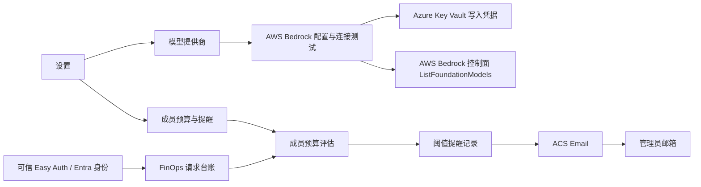

# DataForge Bedrock 接入、Entra 成员预算与邮件提醒设计

**日期：** 2026-07-28

**状态：** 已确认，等待实现计划

**范围：** AWS Bedrock 配置与连接测试、Entra 成员成本归集、成员预算管理、Azure Communication Services Email 管理员提醒，以及设置页入口优化

## 1. 目标与边界

在不改变 MAF 分析内核、工作区、数据、会话、运行记录和产物职责的前提下，补齐三个轻量能力：

1. 在现有模型提供商管理中增加 AWS Bedrock 连接入口；
2. 使用 Entra 身份把请求级估算成本归集到成员，并允许管理员设置成员预算；
3. 当预算达到配置阈值时，通过 Azure Communication Services Email（ACS Email）向管理员发送提醒。

本次保持配置和通知能力与运行时路由解耦。AWS Bedrock 第一版只保存配置并测试连接，不进入 Agent 模型选择、自动回退、APIM 自动配置或生产调用。预算提醒只使用 DataForge 请求台账中的估算成本，不代表 Azure 或 AWS 实际账单，也不执行限流、停用成员或自动切换模型。

以下内容不在本期：

- AWS Bedrock 生产推理、Agent 路由、模型价格采集和调用统计；
- AWS IAM Role、OIDC 联邦、跨账号 AssumeRole 和私有网络接入；
- 向普通成员直接发信；
- Microsoft Graph 邮箱、Exchange Online、SMTP 用户名和密码；
- Azure Cost Management、AWS Cost Explorer 或实际账单对账；
- 超出预算后的自动阻断、自动降级或模型切换；
- 任意邮件 HTML、脚本、APIM XML、Azure 资源 ID 或任意外部 URL 输入。

## 2. 已选方案

### 2.1 总体结构

AWS Bedrock 使用 AWS SDK 和 Signature Version 4，不把它伪装成普通 API Key 接口。用户输入区域、访问密钥 ID、秘密访问密钥和可选临时会话 Token；服务端根据受支持区域构造官方端点，并通过 `ListFoundationModels` 做只读连接测试。

邮件采用 ACS Email、Azure Managed Domain 和 DataForge 后端系统分配托管身份。后端使用 Entra 凭据访问 ACS Email，不保存邮件连接字符串或 SMTP 密码。测试阶段使用 Azure 提供的 `azurecomm.net` 发件域，之后可单独切换到已验证的企业域名。

参考：

- [AWS SigV4](https://docs.aws.amazon.com/IAM/latest/UserGuide/reference_sigv.html)
- [AWS Bedrock ListFoundationModels](https://docs.aws.amazon.com/bedrock/latest/APIReference/API_ListFoundationModels.html)
- [AWS Bedrock 区域端点](https://docs.aws.amazon.com/bedrock/latest/userguide/endpoints.html)
- [ACS Email Azure Managed Domain](https://learn.microsoft.com/en-us/azure/communication-services/quickstarts/email/add-azure-managed-domains)
- [ACS Email 使用 Entra 凭据发送邮件](https://learn.microsoft.com/en-us/azure/communication-services/quickstarts/email/send-email)
- [ACS Email Managed Identity 示例](https://learn.microsoft.com/en-us/samples/azure-samples/communication-services-dotnet-quickstarts/email-sample-send-email-with-managed-identity/)

## 3. AWS Bedrock 配置入口

### 3.1 用户体验

设置首页现有“管理”文字入口改成轻量描边按钮：

`⚙ 配置`

模型提供商页面增加 AWS Bedrock 卡片。配置表单包含：

- 显示名称；
- AWS 区域，从服务端允许列表选择；
- Access Key ID；
- Secret Access Key；
- 可选 Session Token；
- “保存并测试连接”按钮；
- 连接状态、上次测试时间和安全错误类别。

端点由服务端根据区域构造，不允许用户提交任意主机名。保存成功后，凭据输入框立即清空；重新打开页面只显示“已安全保存”，不显示掩码长度、密钥后四位或任何可推断凭据的信息。

### 3.2 数据与接口

沿用现有组织级 provider registry、Key Vault 和 `base_revision` 乐观并发机制，新增 `provider_type=aws_bedrock`。公开记录至少包含：

- `provider_id`；
- `display_name`；
- `provider_type`；
- `region`；
- `connection_state`；
- `available_models`；
- `last_tested_at`；
- `safe_error_category`；
- `revision`；
- 创建和更新时间。

私密字段仅写入 Key Vault 新版本：

- Access Key ID；
- Secret Access Key；
- 可选 Session Token。

复用现有接口：

- `GET /api/model-providers`
- `POST /api/model-providers`
- `POST /api/model-providers/{provider_id}/test`
- `POST /api/model-providers/{provider_id}/rotate-secret`
- `PATCH /api/model-providers/{provider_id}`
- `POST /api/model-providers/{provider_id}/disable`

创建、更新和轮换继续要求 Owner 或 Admin、持久化审计成功以及正确的 `base_revision`。版本冲突返回 `409`，不得部分写入 registry、Key Vault 或审计。

### 3.3 连接测试

后端使用 AWS SDK 访问所选区域的 Bedrock 控制面，执行只读 `ListFoundationModels`。测试结果只返回：

- `connected`；
- `authentication_failed`；
- `access_denied`；
- `region_unavailable`；
- `throttled`；
- `timeout`；
- `provider_unavailable`；
- `secret_unavailable`；
- `configuration_conflict`。

公开响应不返回 AWS request ID、ARN、账号 ID、原始异常正文或响应正文。连接成功只证明配置可用，不代表模型已授权生产调用，也不把 Bedrock 模型加入 Agent 路由。

## 4. Entra 成员成本归集

### 4.1 身份键

成员预算以可信 Easy Auth 声明派生的 `tenant_ref + actor_ref` 为唯一身份键。显示名称和邮箱来自受控的 Entra 目录展示信息，仅用于管理员界面，不作为授权键或聚合键。

请求台账继续保存隐私安全的 `actor_ref`。预算查询只关联：

- 已授权的当前租户；
- 当前或历史上可识别的 Entra 成员；
- 该租户下进入 FinOps 台账的全部组织 workspace；
- 已完成 reconciliation 的请求事实。

原始 Entra object ID 不出现在列表中。管理员需要排障时，可在技术详情中看到安全引用和 Foundry/Application Insights 深链；普通成员不能读取组织级成员明细。

成员退出组织或被停用后，历史成本不被重写或删除；预算行显示“身份已停用”，停止产生新的自动提醒，并保留既有提醒记录。

### 4.2 成本口径

成员消耗取 `FinOpsRequestEvent.estimated_cost`，按请求绑定的不可变价目表 revision 汇总：

- `priced` 和 `estimated` 金额进入已用预算；
- `partial` 金额进入已用预算，同时显示覆盖率；
- `unpriced`、`unavailable` 不按 0 计价，不进入金额；
- 未计价请求数和金额覆盖率必须与预算进度同时展示；
- 相同 DataForge 事件和 APIM evidence 通过 correlation 对账，不重复相加；
- 币种默认 USD，不做运行时汇率换算。

因此“已使用 $190 / $200”只表示可计价请求的估算成本。若仍有未计价请求，界面必须显示“估算覆盖不完整”，邮件中也必须带相同提示。

## 5. 成员预算与提醒页面

### 5.1 页面结构

设置首页新增“成员预算与提醒”设置项，右侧使用已确认的 `⚙ 配置` 按钮进入独立页面。页面保持单列、低噪声布局：

1. 顶部标题、返回设置和简短口径说明；
2. 汇总条：已配置成员、临近阈值、已触发提醒、成本覆盖率；
3. 成员表格：成员、Entra 状态、所属 workspace、当月已用、预算、进度、提醒状态和操作；
4. 邮件提醒配置卡；
5. 最近提醒记录。

成员预算编辑使用小型模态框，不打开整页右侧抽屉。成员行只显示对管理员有决策价值的信息，内部数字 ID 放入“技术详情”，不占用主表。

### 5.2 预算模型

第一版固定为 UTC 自然月预算，币种 USD。每个租户成员只有一个当前生效预算：

- `budget_id`；
- `actor_ref`；
- `period_type=calendar_month`；
- `amount_usd`；
- `thresholds_pct`；
- `enabled`；
- `base_revision`；
- 创建、更新和审计引用。

阈值可自定义，必须为 1–100 之间升序、唯一的整数，默认 `80/95/100`。例如预算 $200、希望约 $190 提醒，可设置 95%。预算金额必须大于 0；停用预算保留历史提醒，但不再评估。

### 5.3 邮件配置

组织级邮件设置包含：

- 启用开关；
- 管理员收件地址；
- 发件人显示名称；
- 邮件主题模板；
- 纯文本正文模板；
- 当前 ACS 连接状态；
- “发送测试邮件”按钮；
- `base_revision`。

第一版只允许一个管理员收件地址，且必须由当前 Owner/Admin 保存。服务端必须把该地址解析到当前租户中处于活动状态的 Owner/Admin；只满足邮箱格式但不是管理员的地址不能保存。模板只支持服务端白名单变量：

- `{{member_name}}`
- `{{budget_amount}}`
- `{{estimated_spend}}`
- `{{usage_percent}}`
- `{{threshold_percent}}`
- `{{period_label}}`
- `{{pricing_coverage}}`
- `{{portal_url}}`

不接受任意 HTML、脚本、外部图片或附件。预览在前端使用示例变量渲染，但发送测试邮件明确标注“测试”，不得制造真实成员超额事件。

### 5.4 前端状态

页面必须区分：

- `loading`：骨架屏保持页面结构稳定；
- `available`：真实数据；
- `partial`：成本覆盖不完整；
- `not_configured`：ACS 或管理员邮箱未配置；
- `permission_required`：托管身份缺少 ACS 权限；
- `unavailable`：服务暂时不可用；
- `conflict`：配置 revision 已变化；
- `empty`：尚无成员预算。

不得使用示例成本填充空状态，也不得把未配置显示成 0。

## 6. 预算评估与邮件发送

### 6.1 处理流程

预算评估接在现有 FinOps reconciliation/rollup 完成之后，不阻塞请求主链。每次成功的 rollup refresh 后触发一次评估，同时运行每 15 分钟一次的耐久补偿扫描；数据库租约和唯一约束保证多实例不会重复执行：

1. 按租户读取本月启用的成员预算；
2. 从 ledger/rollup 读取该成员本月可计价估算成本和覆盖率；
3. 计算已跨越的阈值；
4. 以 `tenant_ref + budget_id + period + threshold` 创建幂等提醒记录；
5. 持久化成功后调用 ACS Email；
6. 更新安全发送状态和时间；
7. 失败按有限次数退避重试，不移动已触发阈值。

同一预算周期的同一阈值最多发送一次。修改预算不会补发已经记录过的相同阈值；若管理员需要重新验证，只能使用“发送测试邮件”。

一次评估若同时跨越多个阈值，只发送最高阈值的一封邮件，并把较低阈值记录为 `suppressed`，避免连续发送多封提醒。后续 reconciliation 即使把估算成本向下修正，也不撤回或重复发送已经触发的阈值；邮件保留触发时金额与覆盖率。自动发送最多重试三次，之后保持 `failed`，等待管理员查看或使用测试邮件排查。

### 6.2 提醒记录

提醒记录保存：

- `alert_id`；
- `budget_id`；
- `actor_ref`；
- `period_key`；
- `threshold_pct`；
- 触发时的预算、估算消耗和覆盖率；
- `delivery_state`：`pending/sending/sent/failed/suppressed`；
- `safe_error_category`；
- `attempt_count`；
- `triggered_at/sent_at/updated_at`；
- 配置 revision 和邮件模板 revision。

不保存邮件正文副本、ACS 原始 message ID、成员原始 object ID 或收件地址明文到普通审计详情。管理员页面显示安全状态；Azure Monitor/Event Grid 可作为后续投递诊断通道，不是第一版发送成功的前置依赖。

### 6.3 ACS Email 连接

Azure 侧需要：

1. Email Communication Services 资源；
2. Azure Managed Domain；
3. 与域连接的 Communication Services 资源；
4. DataForge backend 系统分配托管身份对该资源的最小发送权限；
5. 后端环境配置 ACS endpoint 和 sender address。

ACS endpoint 和 sender address 是部署配置，不由普通管理员填写 Azure 资源 ID。后台设置页只显示 `configured/permission_required/unavailable` 等安全状态。

## 7. 公共接口

新增或扩展以下组织级接口：

- `GET /api/finops/member-budgets`
- `POST /api/finops/member-budgets`
- `PATCH /api/finops/member-budgets/{budget_id}`
- `POST /api/finops/member-budgets/{budget_id}/disable`
- `GET /api/finops/notification-settings`
- `PUT /api/finops/notification-settings`
- `POST /api/finops/notification-settings/test-email`
- `GET /api/finops/budget-alerts`

规则：

- tenant 只从可信 Easy Auth 声明派生；
- 所有接口要求 Owner 或 Admin；
- `actor_ref` 必须解析为当前租户中的有效成员；
- 写接口必须先完成持久化审计；
- 写接口携带 `base_revision`，漂移时返回 `409`；
- 列表使用游标分页；
- 响应包含 `freshness/coverage/data_status/currency`；
- 不返回凭据、原始身份 ID、邮件正文、ACS message ID 或内部错误正文。

## 8. 数据存储

使用 additive SQL migration 增加：

- `df_finops.member_budget`
- `df_finops.notification_setting`
- `df_finops.budget_alert`

所有表以 `tenant_ref` 作为首要隔离字段，并包含 revision、审计引用和时间戳。提醒表对 `tenant_ref + budget_id + period_key + threshold_pct` 建唯一约束，保证多副本执行时不重复发信。

AWS Bedrock 复用 provider registry 和 Key Vault，不另建凭据表。Redis 只缓存成员预算列表和汇总查询，不能作为预算、提醒或发送状态的事实源。

## 9. 权限、安全和功能开关

新增独立开关：

- `DF_AWS_BEDROCK_CONNECTOR_ENABLED`
- `DF_FINOPS_MEMBER_BUDGETS_ENABLED`
- `DF_FINOPS_EMAIL_CONFIGURATION_ENABLED`
- `DF_FINOPS_EMAIL_ALERTS_ENABLED`

保持以下既有生产开关关闭：

- `DF_EXTERNAL_PROVIDER_ROUTING_ENABLED=0`
- `DF_EXTERNAL_PROVIDER_APIM_PROVISIONING_ENABLED=0`
- `DF_FINOPS_ACTIONS_ENABLED=0`

`DF_FINOPS_EMAIL_CONFIGURATION_ENABLED` 控制邮件配置和测试邮件；`DF_FINOPS_EMAIL_ALERTS_ENABLED` 只控制自动阈值提醒。这样可以在自动发送保持关闭时完成真实测试邮件验收。自动提醒开关关闭时，预算仍可读取和编辑，但不产生发送任务。ACS 未配置或托管身份权限不足时，保存预算仍可成功；页面显示通知不可用，且测试邮件返回安全错误，不回显 Azure 错误正文。

Bedrock 凭据必须保持 write-only，禁止进入 API 响应、SQL、日志、审计详情、测试快照、截图、Git 或部署命令。连接测试必须设置短超时、受控区域、SDK 默认 HTTPS 和有限响应大小。

## 10. 测试与验收

### 10.1 自动化

- Python：Bedrock 区域验证、SigV4 SDK 调用封装、秘密脱敏、连接状态、安全错误映射、租户隔离、预算计算、未计价覆盖、阈值幂等、重试、revision 冲突和邮件模板变量；
- API：Owner/Admin 权限、member 拒绝、跨租户拒绝、无原始身份/凭据泄露、ACS 未配置和权限不足状态；
- Node：设置入口、成员预算 view model、阈值编辑、部分/不可用状态、邮件模板预览和 409 重载；
- Vite：生产构建；
- Playwright：桌面与移动端设置入口、成员预算列表、编辑预算、配置管理员邮箱、测试邮件状态、Bedrock 保存并测试、冲突和空状态；
- `git diff --check`。

### 10.2 候选环境真实验收

- Bedrock 使用一组测试凭据完成一次成功的只读模型列表测试；
- 分别验证错误凭据、无 Bedrock 权限和不支持区域，页面只显示安全错误；
- 刷新或换设备后，Bedrock 连接状态与预算配置仍存在，任何凭据都不回传；
- 一名 Entra 成员的当月请求估算成本可由 ledger 手工复算；
- 包含未计价请求时，预算进度和邮件都显示覆盖不完整；
- $200 预算在 95% 阈值跨越时只创建一条提醒；
- ACS Email 使用 Azure Managed Domain 向配置的管理员地址发送一封测试邮件；
- 同一成员、周期和阈值重复评估不重复发信；
- member 无法查看成员预算、管理员邮箱或组织级身份明细；
- 设置首页 `⚙ 配置`、独立预算页和移动端排版通过截图审查；
- backend/web 零流量 candidate Healthy，关键错误日志为 0。

### 10.3 上线门禁

先发布 SQL additive migration 和后端零流量 candidate，再发布 web candidate。只有在 Bedrock 安全连接测试、预算归集复算、ACS 测试邮件、桌面/移动 UI 和权限隔离全部通过后，才允许开启读取和预算配置。

先开启 `DF_FINOPS_EMAIL_CONFIGURATION_ENABLED` 完成真实测试邮件，再最后单独开启 `DF_FINOPS_EMAIL_ALERTS_ENABLED`。自动提醒开关开启前需要用户明确批准。此版本不得开启 Bedrock 生产路由、APIM 自动配置或 FinOps 自动执行。
